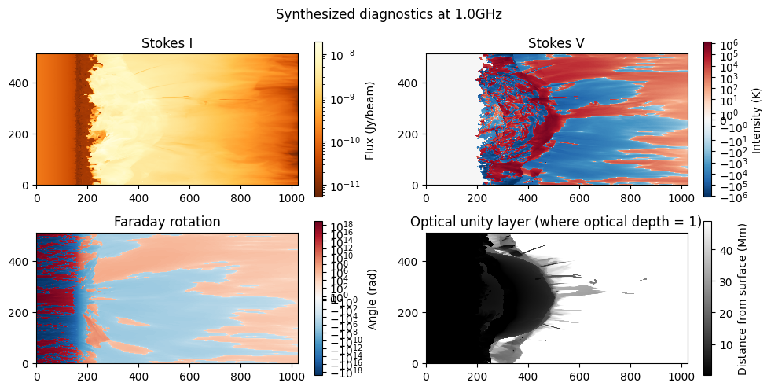

# Python SOLar RADio Coronal Emission Forward Synthesis Model


Generated maps from gyroresonance and bremsstrahlung coronal simulation of a synthetic MHD atmosphere, looking through the corona above a sunspot

> Abstract:<br>pySOLRAD forward synthesizes the dominant forms of solar coronal radio emission through a model solar atmosphere. The model simulates the interaction of particles throughout a synthetic solar atmosphere to produce bremsstrahlung and gyroresonance radio emission, and then ray-traces the absorption and emission mechanisms of those signals to the observer. As a result, several synthetic observables are generated, each representing a prediction of how solar radio signals would appear on Earth from a radio telescope. Because the properties of observed radio waves are physically dependent on the parameters of the model (eg. density, temperature, and magnetic field distributions), comparison of the outputted synthetic images with actual observations can be used to fine-tune these initial parameters and arrive at a much more complete understanding of the physical processes operating within the corona. The synthetic solar atmosphere passed to pySOLRAD is typically one generated from a magnetohydrodynamic (MHD) coronal simulation, which provides distributions for magnetic field, temperature, and density throughout the corona. The goal of pySOLRAD is to to improve our current understanding of the physical processes operating within the solar corona, especially in the less well-understood regime of solar radio physics.

# Features
- Supports synthesis and simulation of both bremsstrahlung and gyroresonance radio emission (dominant forms of solar radio emission) through any given 1D, 2D, or 3D artifical solar atmosphere
- Generates maps, observables, and quantities for studying coronal intensity, circular/linear polarization, faraday rotation, dispersion measure, and optical depth
- Handles conversions between flux, flux density, intensity, frequency, polarization, and other standard units

# Scripts
Create conda environment from cached `environment.yml`:
```batch
conda env create -f environment.yml
```

Update conda `environment.yml` (after installing a new dependency):
```batch
conda env export --from-history > environment.yml
```

Create conda environment from scratch (in case `environment.yml` is broken):
```batch
conda create -n pysolrad -c conda-forge python=3.13 numpy=2.2 numba=0.61 pyhdf pytables h5py sunpy
```

# File Descriptions
Notebooks:
* `1d-synthesis`: synthesize frequency-dependent Stokes IV for a 1D representation of the solar environment from Allen's Astrophysical Quantities
* `full-disk-synthesis`: synthesize images from PSI's MAS model for the full solar disk
* `sunspot-synthesis`: synthesize images from MURaM model of a bipolar sunspot
* `data-comparison`: generate comparable maps from Nobeyama Radioheliograph and Extended Owens Valley Solar Array data

Folders:
* `data`: data from Nobeyama Radioheliograph (NORH) and EOVSA
* `out`: sunspot and full-disk images from `sunspot-synthesis` and `full-disk-synthesis` runs
* `models`: contains synthetic models of the solar atmosphere
* `old_examples`: contains raw synthesis examples for all three models (without the use of `pysolrad`)

# Running the Notebooks
Most notebooks require a local download of the [MHD models](models/models.md).

# Using pySOLRAD
```py
import pysolrad

# works with 1D, 2D, 3D rays with any shape, specify axis arg for line-of-sight dimension
rays = pysolrad.RayCollection(temp_rays, btot_rays, blos_rays, ne_rays, dl_rays, axis=-1) # in this case, 3D arrays of ray quantities, shape=(x, y, z)
image = pysolrad.synthesize(rays, 1e9, dogyro=True) # synthesize single image at 1GHz with gyroresonance

plt.figure()
plt.imshow(image.I) # show Stokes I intensity map
plt.show()
```

Other features:
- Synthesize a range of frequencies and perform vectorized operations on all images
- Get contribution function, integrands, optical depths, and other quantities for each ray point along line-of-sight
- Get optical unity, faraday rotation angle, Stokes V, emissivity-weighted $B_\text{LOS}$, unity indices, and dispersion measure maps for a given frequency
- Isolate left-/right-handed modes of circular polarization for a number of the above quantities
- Works for any n-dimensional rays of any shape
- Get maps for spectral index, quantities at unity index, and inverted BLOS