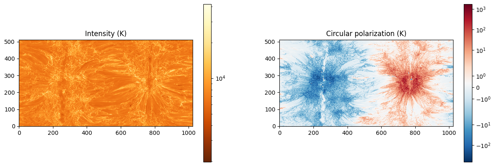

# Python SOLar RADio Forward Synthesis Model


Figure 1: Stokes IV maps from gyroresonance and bremsstrahlung coronal simulation of a synthetic MHD atmosphere above a sunspot

> pySOLRAD forward synthesizes the dominant forms of coronal radio emission through a model solar atmosphere in order to improve our current physical understanding of the solar corona. The model simulates the interaction of particles throughout a synthetic solar atmosphere to produce bremsstrahlung and gyroresonance radio emission, and then ray-traces the absorption and emission mechanisms of those signals to the observer. As a result, several synthetic observables are generated, each representing a prediction of how solar radio signals would appear on Earth from a radio telescope. Because the properties of observed radio waves are physically dependent on the parameters of the model (density, temperature, and magnetic field distributions), comparison of the outputted synthetic images with actual observations can be used to fine-tune these initial parameters and arrive at a much more complete understanding of the physical processes operating within the corona. The synthetic solar atmosphere given to pySOLRAD is typically one generated from a pre-built magnetohydrodynamic (MHD) coronal simulation, which provides distributions for magnetic field, temperature, and density throughout the corona.

Supports synthesis of bremsstrahlung (intensity and circular polarization), gyroresonance (intensity and circular polarization), and faraday rotation (linear polarization)

# Scripts
Create conda environment from cached `environment.yml`:
```batch
conda env create -f environment.yml
```

Update conda `environment.yml` (after installing a new dependency):
```batch
conda env export --from-history > environment.yml
```

Create conda environment from scratch (in case `environment.yml` is broken):
```batch
conda create -n pysolrad -c conda-forge python=3.13 numpy=2.2 numba=0.61 pyhdf pytables h5py sunpy
```

# File Descriptions
Notebooks:
* `1d-synthesis`: synthesize Stokes IV from a 1D representation of the solar environment, from Allen's Astrophysical Quantities
* `full-disk-synthesis`: synthesize Stokes IV and optical depth images from PSI's MAS model for the entire solar disk
* `sunspot-synthesis`: synthesize Stokes IV and optical depth images from MURaM model of a sunspot
* `norh-data`: generate Stokes IV images from real Nobeyama Radioheliograph data

Folders:
* `data`: data from Allen's Astrophysical Quantities, Nobeyama Radioheliograph, MURaM, and MAS
* `out`: sunspot and full-disk images from `sunspot-synthesis` and `full-disk-synthesis` runs